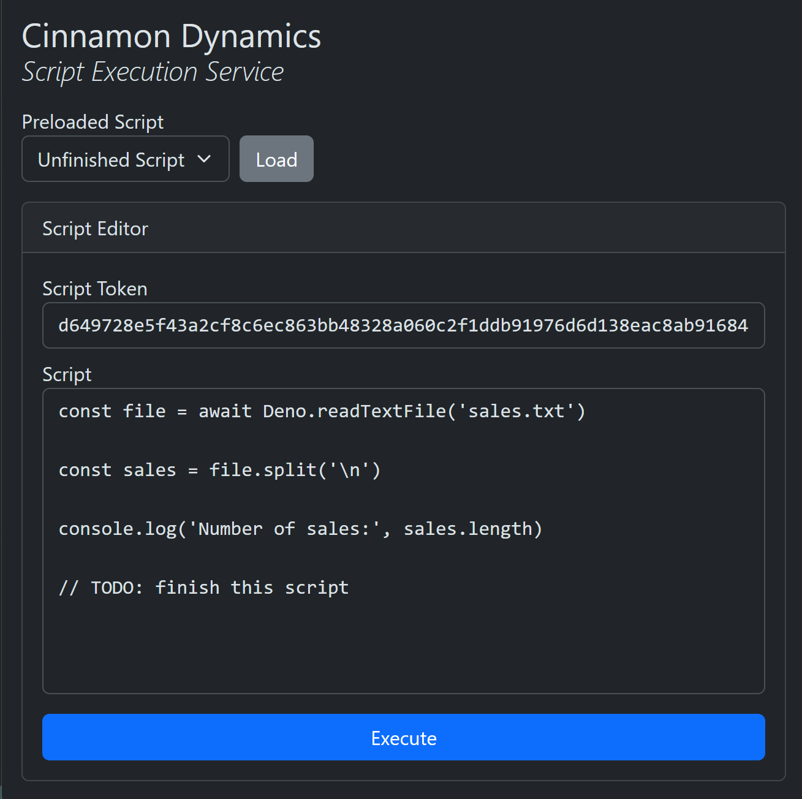

# Crypto / Vinegar Times 3
25 points - 338 solves - By Sylvia Lee and June Lee

## Source
```
We can't speak French and just say what we see.
We also don't know what underscores are add them yourself.
put ONLY the final decrypted cipher in bcactf{}, no intermediate steps.

key - vinegar

cipher 0 - mmqaonv
cipher 1 - seooizmt
cipher 2 - bdoloeinbdjmmyg <- THIS ONE
```

## Decryption

- As the name of the challenge suggests with slight wordplay, the cipher used here is Vigenere cipher
- Using `vinegar` as key to decrypt `cipher 0`, we get `redwine` as plaintext.
- So we use `redwine` as the new key to decrypt `cipher 1`, we get `balsamic` as plaintext.
- So we then use `balsamic` as key to decrypt `cipher 2` to get the final plaintext `addtosaladyummy`.
- Then we add underscores and "bcactf{}" to form the flag.

## Flag
- The flag is `bcactf{add_to_salad_yummy}`


# Crypto / Time Skip
50 points - 313 solves - By Jeremy Lee

## Source

- One of our problem writers got sent back in time! We found a piece a very very old piece of parchment where he disappeared, alongside a long cylinder. See if you can uncover his flag!

- parchment.txt:
    `hsggna0stiaeaetteyc4ehvdatyporwtyseefregrstaf_etposruouoy{qnirroiybrbs5edmothssavetc8hebhwuibihh72eyaoepmlvoet9lobulpkyenf4xpulsloinmelllisyassnousa31mebneedtctg_}eeedeboghbihpatesyyfolus1lnhnooeliotb5ebidfueonnactayseyl`

## Decryption
- The Description said this ciphertext was found way back in time, which leads us to Caeser ciphers
- By simply using the Identify Cipher feature at [dcode.fr](https://www.dcode.fr/identification-chiffrement) it predicts this to be [Caeser's Square CIpher](https://www.dcode.fr/chiffre-carre-de-cesar)
- We then put the ciphertext and run a bruteforce with maintain punctuation and spaces on so it can detect underscores and words better to get the flag.
- Output : `heyguysimkindoflostprobablynotgoingtosurvivemuchlongertobehonestbutanywaystheflagisbcactf{5c7t4l3_h15t04y_qe829xl1}pleasesendhelpimeanbythetimeyouseethisiveprobablybeendeadforthousandsofyearsohwellseeyoulaterisupposebyee_`

## Flag
- The flag is `bcactf{5c7t4l3_h15t04y_qe829xl1}`


# Crypto / RSAEncrypter
100 points - 224 solves - By Zevi

## Source
- I made an rsa encrypter to send my messages but it seems to be inconsistent...
- Netcat Links: `nc challs.bcactf.com 31452`
### Server Files
- [rsa_encrypter.py](../assets/scripts/RSAEncrypter/rsa_encrypter.py)

## Encryption
- There is an `encode` function that takes the flag as `plaintext`, generates random `p` and `q` and encrypts the flag using RSA with `e = 3`. It returns the `ciphertext` and `modulus`.
- The server lets us use the `encode` function multiple times, so we can get multiple values of `ciphertext` and `modulus`.

## Decryption
### Scripts
- [solve.py](../assets/scripts/RSAEncrypter/solve.py)
### Explanation
- So, after getting 3 results of `encode` we use Chinese Remainder Theorem to get `m^3^ mod (n1*n2*n3)` which is `m^3^` itself as `n1*n2*n3` is 3072 bits long, way bigger than `m^3^`.
- Now that we have `m^3^` we can simply find its cube root to get the `plaintext`

## Flag
- The flag is `bcactf{those_were_some_rather_large_numbersosvhb9wrp8ghed}`


# Crypto / Encryptor Shop
50 points - 189 solves - By Mudasir

## Source
- After realizing how insecure the systems of many companies are (they're always getting hacked), I decided to start offering Encryption as a Service (EaaS). With such a strong guarantee of security, I'll even give you the source code AND my encrypted super secret flag.
- Netcat Links: `nc challs.bcactf.com 31704`
### Server Files
- [server.py](../assets/scripts/Encryptor-Shop/server.py)

## Encryption
- The server generates 3 large primes of order 1024 bits `p,q,r`.
- It initially uses `p` and `q` for the RSA encryption and lets us encrypt 3 messages.
- It returns `c`, `n` and `e`, out of which we only have use for `n` which is `p*q`.
- Then it chooses `p` and `r` for RSA and encrypts the flag for us. It returns `c`, `n` and `e`.

## Decryption
### Server Files
- [solve.py](../assets/scripts/Encryptor-Shop/solve.py)
### Explanation
- Since we have `p*q` and now `p*r` , we can use gcd to get the prime `p`. 
- Now we can extract `r` from the second modulus and solve the RSA since we have both primes.

## Flag
- The flag is `bcactf{w0w_@lg3br@_d3in48uth934r}`


# Crypto / Cha-Cha-Slide
100 points - 134 solves - By Thomas

## Source
- I made this cool service that lets you protect your secrets with state-of-the-art encryption. It's so secure that we don't even tell you the key we used to encrypt your message!
- Netcat Link: `nc challs.bcactf.com 31594`
### Server Files
- [server.py](../assets/scripts/cha-cha-slide/server.py)

## Encryption
- The server is using `ChaCha20` for enryption which is a stream cipher.
- `ChaCha20` generates a stream of bytes from the `key` and `nonce`.
    - It creates a counter using the `nonce` and then encrypts it using the `key` to form the `bytestream`.
- Then it XORs the `bytestream` with the `plaintext` bytes to get the `ciphertext`.

- As the `key` and `nonce` remain the same in an instance of the netcat, the stream of bytes will remain the same in every encryption.
- Hence the `plaintext` is xored with the same bytes every time.
- The server allows us to encrypt our own `plaintext` once, so we can extract the `xorkey` using the `plaintext` and `ciphertext` we recieve.
- The server gives us the encrypted secret message so we can extract the secret message using the `xorkey`, which we have to submit to get the flag.

## Decryption
### Scripts
- [solve.py](../assets/scripts/cha-cha-slide/solve.py)
### Explanation
- First we recieve the encrypted secret message.
- Then we send as many '\x00' bytes as the length of the ciphertext.
- So the ciphertext it returns will be the `xorkey` itself.
- Then we xor the original ciphertext with the `xorkey` to get the secret message and submit it to get the flag.

## Flag
- The flag is `bcactf{b3_C4rEFu1_wItH_crypT0Gr4phy_7d12be3b}`


# Crypto / rad-be-damned
150 points - 100 solves - By Nikhil

## Source
- My friend seems to be communicating something but I can't make out anything. Why do we live so close to Chernobyl anyways?
### Server Files
- [message.py](../assets/scripts/rad-be-damned/message.py)
- [output.txt](../assets/scripts/rad-be-damned/output.txt)

## Encryption
- The script reads the flag from a file and uses it as `plaintext`
- It then encrypts the flag using the `encrypt` function which is a stream cipher as it encrypts one letter at a time.
    - This encryption works on each byte of the `plaintext` separately and adds 12 bits to the `enc_plaintext` per byte.
    - Out of which , the first 8 bits is the byte itself and then next 4 bits is the result of some bitwise operations.
- It then modifies the `enc_plaintext` using the `rad` function.
    - The `rad` fucntions simply goes through every block of 12 bits and flips a random bit in them.

## Decryption
### Scripts
- [solve.py](../assets/scripts/rad-be-damned/solve.py)
### Explanation
- As this is a stream cipher we don't need to reverse or understand the `encrypt` function as we could just brute the byte.
- First we work on the `rad` function which is randomly flipping one bit.
    - We split the ciphertext from [output.txt](../assets/scripts/rad-be-damned/output.txt) into blocks of 12 bits and then work on them separately.
    - For every block , `rad` function could have either flipped one of the first 8 bits which is the byte itself or one of the last 4 bits which acts as a `checksum`.
    - First we loop for the first 8 bytes and flipping one bit in an iteration, then encrypting the byte formed by the first 8 bits using the `encrypt` function to get its result.
        - If the last 4 bits of the encryption result matches with the `checksum`, then that byte is the actual byte from the `plaintext`.
    - If none of the 8 iterations match then we iterate over the last 4 bits by flipping one bit in each iteration.
        - If the result of encryption of the byte formed using the first 8 bits matches with the new `checksum` after flipping the bit then the first 8 bits formed the actual byte for the `plaintext`.
- This way we can get the bytes of the plaintext one byte at a time using a simple brute.

## Flag
- The flag is `bcactf{yumMY-y311OWC4ke-x7CwKqQc5fLquE51V-jMUA-aG9sYS1jb21vLWVzdGFz}`


# Crypto / Superstitious-2
150 points - 46 solves - By Marvin

## Source
- My client is a bit picky with the primes they are willing to use...
### Server Files
- [superstitious-2.py](../assets/scripts/superstitious2/superstitious-2.py)
- [superstitious-2.txt](../assets/scripts/superstitious2/superstitious-2.txt)

## Encryption
- The script generates 2 primes p and q using the mask `((1<<1024)-1)//3` which is `0b01010101....`
- So every alternate bit of p and q are 0.
- Since we have `n`, we can check the validity of `p` and `q` upto `k` bits as:
    - Let `p_` be the last `k` bits of `p` and `q_` be the last `k` bits of `q` and `n_` be the last `k` bits of `n`
    - Then `(p_*q_)%pow(2,k) == n_`, i.e. the last `k` bits of `p*q` should match the last `k` bits of `n`.

## Decryption
### Scripts
- [solve.py](../assets/scripts/superstitious2/solve.py)
### Explanation
- So we start will `p,q = 0,0`.
- Then we run a loop guess the next 2 bits in each iteration.
    - As we know every alternate bit is `0` , so the only possibility for the 2 bits are `00` and `01`
    - For every possibility of the pair `p,q` that we have saved uptil the current 2 bytes:
        - We form the next set of possible `p_,q_` by adding `00` and `01` bits to `p` and `q`
        - Then we check if that `p_,q_` value pair is valid by using the condition `(p_*q_)%pow(2,k) == n_`
        - If it is valid we add it to the new set of possible `p,q` for the next iteration.
- Since the primes are 1024 bits long we will run this loop 512 times to get all possible `p,q` pairs in the end.
- Then we check for every such possibility if `p*q == n` and one of them will satisfy.
- Now that we have `p` and `q` we can decrypt the RSA in the general way.

## Flag
- The flag is `bcactf{l4zy_cHall3nG3_WRITinG_f8b335319e464}`

# crypto/Cinnamon Dynamics writeup 🩸
author: Thomas

## Challenge Description
>Cinnamon Dynamics, an innovative technology company, provides a service for the public to execute short scripts to query some limited information about the company. To combat abuse, they've instated a requirement for all scripts to be approved by a company employee before they can be executed. Approved scripts are granted a "script token" that allows them to be executed an indefinite amount of times, so long as the script is not modified. Unfortunately, it seems that malicious actors have managed to circumvent the security system...  
**Resources**:  
Web servers: challs.bcactf.com:31077
Static resources: [server.js](../assets/scripts/cinamon/server.js)

## Solution

I also managed to get the first blood in this challenge \:D  
Let's start analysing the code.

```js
...
const secretKey = readFileSync('secret-key.txt', 'utf-8')
...
const safeCompare = (a, b) => {
    a = Buffer.from(a, 'utf-8')
    b = Buffer.from(b, 'utf-8')

    return a.length === b.length && timingSafeEqual(a, b)
}

app.post('/execute', (req, res) => {
    const { token, script } = req.body
    ...
    const hash = createHash('sha256')
        .update(secretKey)
        .update(Buffer.from(script.replaceAll('\r\n', '\n'), 'binary'))

    if (!safeCompare(hash.digest('hex'), token)) {
        return res.render('execute', {
            error: 'Script token is invalid! ' +
                'Contact a Cinnamon Dynamics employee to get your script ' +
                'approved and receive a valid token for it.'
        })
    }
    ...
})
```

$\text{Observation 1.}$ The server loads up a $\texttt{secretKey}$ from a local file.

$\text{Observation 2.}$  It compares the token ($\text{sha256}$ hash) of the $\texttt{script}$ we provide with the hash of $\texttt{secretKey} \mathbin\Vert \texttt{script}$. Where, $\mathbin\Vert$ denotes string concatenation. Also, the hashes are compared using $\texttt{timingSafeEqual}$, which makes it safe against timing attacks.

These observations by themselves don't hint a lot at anything, so let's look at the website and soon enough we find that it has an unfinished script loaded that we can load and get the token for.  



This immidiately gives it away that the server is prone to [Length Extension Attack](https://en.wikipedia.org/wiki/Length_extension_attack). 

We have a known $\texttt{script}$ and a valid $\texttt{token}$ corresponding to it. Just by using this information, we can generate a $\texttt{script} \mathbin\Vert \texttt{payload}$ with a valid token even without the knowing the $\texttt{secretKey}$.

More on this here:
- [Breaking SHA256: length extension attacks in practice (with Go)](https://kerkour.com/sha256-length-extension-attacks)
- [Length extension attack (with Rust)](https://github.com/marcelo140/length-extension)

There is a catch though. For using this attack, we must know the the exact length of the key. Since we have no way of getting that from the server, we'll just brute force our way till we get a valid response.

I tried implementing these by myself in python, but found out midway that [this](https://github.com/stephenbradshaw/hlextend) exists. After some testing and trial and error by runnning the server locally, I came up with this final script:

## Script
```py
import requests
import hlextend # https://github.com/stephenbradshaw/hlextend

# the unfinished script. 
# this works because it
# has a comment in its end
# so adding any bytes won't
# affect the flow of the script
SCRIPT = rb'''const file = await Deno.readTextFile('sales.txt')

const sales = file.split('\n')

console.log('Number of sales:', sales.length)

// TODO: finish this script'''
TOKEN = 'd649728e5f43a2cf8c6ec863bb48328a060c2f1ddb91976d6d138eac8ab91684'

# notice the newline in the beginning
# this is to get out of the // comment
PAYLOAD = rb'''
console.log(await Deno.readTextFile("flag.txt"));'''

# the key length I found after running this for a while was 31
key_len = 1
sha2 = hlextend.new('sha256')
while True:
    
    NEW_SCRIPT = sha2.extend(PAYLOAD, SCRIPT, key_len, TOKEN)
    NEW_TOKEN  = sha2.hexdigest()

    data = {
        'token': NEW_TOKEN,
        'script': NEW_SCRIPT.decode('raw_unicode_escape'),
    }

    # response = requests.post('http://localhost:5500', data=data)
    response = requests.post('http://challs.bcactf.com:31106/execute', data=data)
    
    if not 'invalid!' in response.text.lower():
        print(f'{key_len=}')
        print(response.text)
        # bcactf{Th1S_I5_JuST_4_l1TtLe_t0o_1N5ECur3_95af828f32}
        break
    
    # if invalid, try with the next length.
    key_len += 1
```

##### `.decode('raw_unicode_escape')`
Since we are using the length extension attack, we have to use some $\text{NULL bytes}$ and some other $\text{bytes}$ for padding. Here is what the final script payload actually looks like:

`b'\x80\x00\x00\x00\x00\x00\x00\x00\x00\x00\x00\x00\x00\x00\x00\x00\x00\x00\x00\x00\x00\x00\x00\x00\x00\x00\x00\x00\x00\x00\x00\x00\x00\x00\x00\x00\x00\x00\x00\x00\x00\x00\x00\x00\x00\x00\x00\x00\x00\x00\x00\x00\x00\x00\x00\x00\x00\x00\x00\x00\x00\x00\x00\x00\x00\x00\x05\xe0\nconsole.log(await Deno.readTextFile("flag.txt"));'`

Some of these have $\text{ASCII}$ value of more that $128$ which doesn't allow the conversion of the new script to string using $\texttt{.decode()}$ and if we pass these $\text{bytes}$ directly to $\texttt{requests}$ module's payload, it will $\text{HTMLencode}$ them and convert to string before sending it to the server. And since the server reads strings only, this will immidiately invalidate the script.  So we can't send $\text{bytes}$ and also can't encode the padding information in strings. Therefore, we will have to use `.decode('raw_unicode_escape')` this just works in the opposite way we use raw strings in python using the `r` character.

**Flag**: `bcactf{Th1S_I5_JuST_4_l1TtLe_t0o_1N5ECur3_95af828f32}`