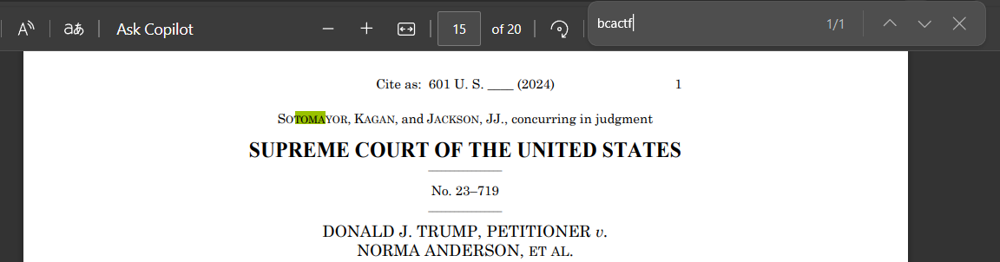

# Forensic/Static-writeup

## Challenge Description


We have received a MP4 file and the MD5 of a file.

## Solution

As the hints suggested, I began searching for the metadata.

```bash
$ exiftool static.mp4
Compressor Name                 : Lavc60.31.102 libx264rgb
Encoder                         : StaticMaker https://shorturl.at/AUKZm
```

Two things seemed sus to me: the Compressor and the Encoder. I then checked the above link for StaticMaker and realized they provided a documentation file with information about the StaticMaker software.

```
The StaticMaker ™ utility converts any binary file into a video, suitable for use in … some application somewhere, probably.
The default configuration is width=256, height=256.

The program works by:
1. Compressing the data
2. Padding to a size that is a multiple of (6*width*height) bits
3. Splitting the data into “subframes” of size (2*width*height) bits
4. Writes data to video frames, which each triplet of three consecutive subframes are written to the red, green, and blue channels of one frame, respectively
     Data written in row-major order
     2 bits per pixel per channel
THE SOFTWARE IS PROVIDED “AS IS”, WITHOUT WARRANTY OF ANY KIND, EXPRESS OR IMPLIED, INCLUDING BUT NOT LIMITED TO THE WARRANTIES OF MERCHANTABILITY, FITNESS FOR A PARTICULAR PURPOSE AND NONINFRINGEMENT.
```
WorkFlow:- 
1. Extraction of Frames:
    Utilizes FFmpeg to extract frames from the video.

2. Extraction of Pixel Data:
    Decodes the RGB channels of each frame.
    Extracts 2 bits per pixel per channel
    
3. Reconstruction of Binary Data:
   Combines the extracted bits into a single stream.
   Reconstructs the original binary data by converting the bits back into bytes.

For Extraction of Frames:-

`$ ffmpeg -i static.mp4 frame_%04d.png`

Using ffmpeg, we extracted 72 frames in PNG format from the MP4 video.


Next, I wrote a Python script to accomplish steps 2 and 3.

```python
import hashlib
from PIL import Image
import numpy as np

def decode_frames(frame_prefix, frame_count, width=256, height=256):
    channels = ['R', 'G', 'B']
    bit_position = 4  # Bit position(4or6) chosen based on successful MD5 checksum match, were taken bitpositions [2,4,6,8]
    
    data_bits = []
    for frame_idx in range(1, frame_count + 1):
        frame_path = f"{frame_prefix}{frame_idx:04d}.png"
        frame = Image.open(frame_path)
        frame = frame.convert("RGB")
        pixels = np.array(frame)
        
        # Extract the specified bits from each color channel
        r_channel = (pixels[:, :, 0] & (0b11 << bit_position)) >> bit_position
        g_channel = (pixels[:, :, 1] & (0b11 << bit_position)) >> bit_position
        b_channel = (pixels[:, :, 2] & (0b11 << bit_position)) >> bit_position
        
        # Flatten the channels and convert to bit strings
        for bits in r_channel.flatten():
            data_bits.append(format(bits, '02b'))
        for bits in g_channel.flatten():
            data_bits.append(format(bits, '02b'))
        for bits in b_channel.flatten():
            data_bits.append(format(bits, '02b'))
    return ''.join(data_bits)

def check_padding(data_bits, width, height):
    size = 6 * width * height
    print("The size is", size)
    actual_size = len(data_bits)
    print('The actual size is ', actual_size)
    if actual_size % size == 0:
        print("Multiple of size")
        # No padding to remove
        return data_bits   # size was already in multiple so need for removing the padding.
    
    # Calculate the number of excess bits to remove
    padding_size = actual_size % size
    
    # Remove the excess bits
    data_bits = data_bits[:-padding_size]
    return data_bits

def bits_to_bytes(data_bits):
    byte_arr = bytearray()
    for i in range(0, len(data_bits), 8):
        byte = data_bits[i:i+8]
        byte_arr.append(int(byte, 2))
    return bytes(byte_arr)

def calculate_md5(data):
    md5 = hashlib.md5(data).hexdigest()
    return md5

# Parameters
frame_prefix = 'frame_'
frame_count = 72  # Total number of frames
width = 256
height = 256

# Decode frames
data_bits = decode_frames(frame_prefix, frame_count, width, height)

# Checking padding
data_bits = check_padding(data_bits, width, height)

# Convert bits to bytes
compressed_data = bits_to_bytes(data_bits)

output_path = 'extracted_data.bin'
with open(output_path, 'wb') as f:
    f.write(compressed_data)
print("Extracted data saved.")

# Calculate and print MD5 checksum
calculated_md5 = calculate_md5(compressed_data)
print(f"MD5 checksum of extracted data after removing padding: {calculated_md5}")

```
The extracted bin matches the MD5 checksum provided in the description. As I began analyzing the file, I employed several tools. When I used binwalk, it indicated the presence of Zlib compressed data, which I then extracted.
```bash
$ binwalk -e extracted_data.bin

DECIMAL       HEXADECIMAL     DESCRIPTION
--------------------------------------------------------------------------------
40522         0x9E4A          Zlib compressed data, default compression

``` 

There are two approaches: one is quick and easy, while the other is little time-consuming. 
This is the quick and easy method for lazy people like me to get the flag.

```bash
g0j0:~/Pictures/_extracted_data.bin.extracted$ ls
9E4A  9E4A.zlib
g0j0:~/Pictures/_extracted_data.bin.extracted$ strings * | grep bcactf{
bootpc[[ --bootfile %bootfile%]] --dev %iface%[[ --server %server%]][[ --hwaddr %hwaddr%]] --returniffail --serverbcast
can't enable bcast on ARP socket
bcache
sbcast
nulsohstxetxeotenqackbel bs ht nl vt ff cr so sidledc1dc2dc3dc4naksynetbcan emsubesc fs gs rs us sp
http-alt    8080/tcp    webcache    # WWW caching service
TTJvQS8TUoKU1xrBeKJR3Stwbbca+few4GeXVtt8YVMJAygCQMez2P2ccGrGKMOF
bcactf{imag3_PROc3sSINg_yaY_2ea104d700c1a8}
``` 
Another one is to do it proper way:- 

```bash
$ zlib-flate -uncompress < 9E4A.zlib > output
$ exiftool output
$ file output
output: POSIX tar archive
```
I began extracting the tar archive once we obtained it.

```bash
$ tar -xf output
$ ls
bin  dev  etc  home  lib  out
```
We got some folders let's check out 

```bash
$ tree .
.
├── bin
│   ├── arch -> /bin/busybox
│   ├── ash -> /bin/busybox
│   ├── base64 -> /bin/busybox
│   ├── bbconfig -> /bin/busybox
...
├── home
│   └── admin
│       └── Documents
│           ├── not_social_security_number.txt
│           └── social_security_number.txt
└── lib
    ├── apk
    │   ├── db
    │   │   ├── installed
    │   │   ├── lock
    │   │   ├── scripts.tar
    │   │   └── triggers
    │   └── exec
    ├── firmware
    ├── ld-musl-x86_64.so.1
    ├── libapk.so.2.14.0
    ├── libc.musl-x86_64.so.1 -> ld-musl-x86_64.so.1
    └── libcrypto.so.3

45 directories, 145 files
```
I began searching for the text files in the admin directories.

```bash
~/home/admin/Documents$ cat not_social_security_number.txt
bcactf{imag3_PROc3sSINg_yaY_2ea104d700c1a8}
```
Hooray!!! We captured the flag just 3 minutes before the CTF ended. ;p

## Flag

`bcactf{imag3_PROc3sSINg_yaY_2ea104d700c1a8}`

# Forensic/Mysterious Melody-writeup

## Challenge Description


We have received a WAV file.

## Solution

So, I opened the WAV file using Sonic Visualizer software. Initially, I was unsure of what to do after examining the Spectrogram. Then, I analyzed the melody range spectrogram and the peak frequency spectrogram.

```
You can add the Spectrogram, Melody Range Spectrogram, and Peak Frequency Spectrogram from the Pane menu.
```


[peak2.xcf](./assets/images/forensics/melody/peak2.xcf)

Where I noticed something unusual that resembled Morse code, but it wasn't. On the left side, there were 16 increasing lines, which matched the base16 hint provided. The hex values for the start of the flag 'bcactf{' corresponded to the highs and lows of the lines on the right side. This clue confirmed it was part of the flag, and from there, we decoded all the highs and lows.

`6263616374667B62656175746966756C5F6D656C6F64795F62656175746966756C5F6861726D6F6E797D`

## Flag 
`bcactf{beautiful_melody_beautiful_harmony}`

# Forensics/23-719-writeup

## Challenge Description

We are given a pdf along with the following description:

That's a nice unanimous supreme court decision you've made public, sure would be a shame if someone didn't properly clean up remnants of a prior version of the document before publishing it.

## Solution

The solution was pretty straight forward we just find for the initials of the flag i.e. `bacactf` and highlight some of the text 



 So we select that text and paste it in a text editor and we reveal the flag :


 
So our flag becomes ->

`bcactf{rEAl_WOrLd_appLIc4t1ons_Of_cTf_ad04cc78601d5da8}`

.................................................................

# Forensics/sheep-writeup

## Challenge Description

We are given a .shp along with the following hint:

Figure out what type of file it is and see if there are tools you can use or modify.

## Solution

Upon some research we find out that .shp are ESRI shapefiles used in GIS softwares like Google Earth Pro but such softwares require 3 of such files as mandatory which are a .shp, .shx and a .dbf file which work complementorily to produce the geographical data but some more reserach yielded this software that can standalone process a .shp file (https://softradar.com/shp-viewer/). So we just load our sheep.shp in the software and thats it we get the flag :


 
So our flag becomes ->

`bcactf{SHaPE_f1lEd_b54a11ac9c87c8}`

...................................................................

# Forensics/Manipulate Spreadsheet 2-writeup

## Challenge Description

We are given an excel file for this challenge:

## Solution

The first that we notice is this long string written in the A1 cell of the excel sheet.


The hex decode of this string reveals the following hint:
    
    In digital fields where data lies,
    Secret pages beneath clear skies.
    Cells entwine, mysteries feel,
    Layers of secrets they reveal.
 
The layers part hint that there maybe a hidden sheet in this file and exactly that happens to be the case we unhide the sheet 2 of this excel file and there we find some bytes and index data along with another hint in the A1 cell of the sheet


The hex decode of this hint reveals:

    Lurking shadows, secrets play,
    Stealthy whispers on display.
    BITS aligned, LEAST in SIGht,
    Gleams of secrets, veiled in light.

This reveals that we have to arrange the bytes in order of indices and then do LSB extract of the bytes so we do that and we get our flag as:

`bcactf{600D_job_Using_900G13_SHe3t5}`

...........................................................

# Forensics/Touch Tone Telephone-writeup

## Challenge Description

We are given a .wav along with the following hints:

    -DTMF is a really cool technology
    -There also used to be A, B, C, and D menu selection keys
    -How many keys are there in total? Is it a computer science-y number?
    -For key to number, Start at top left, reading order. (Sorry, 0 is not 0, my bad)

## Solution

Based on the hints the course of action gets pretty much cleared that we need to extract the dtmf tones of our wav file then perform a little substitution of keys before finally hex decoding the message. Now there are many online tools to detect the dtmf tones of a wav file but I used the CLI tool `multimon-ng` which gives us a result for the detected dtmf tones as 

```47656*6*6D3#315B656*6A6D606531B46D31B4676531434A424A54463147656*B16*686#653#19546768BA316A626*6*316062B831636531B3656A6DB364656431666DB331B2B5626*68B4B83162BABAB5B3626#6A6531B1B5B3B16DBA65BA3#1919466DB3316A6762B33131A13*316B65B431686#6465B731A1B7A6A23#19466DB3316A6762B33131A23*316B65B431686#6465B731A1B7ABA33#19466DB3316A6762B33131A33*316B65B431686#6465B731A1B7A66A3#19466DB3316A6762B33131AA3*316B65B431686#6465B731A1B7AAA73#19466DB3316A6762B33131A43*316B65B431686#6465B731A1B7A3633#19466DB3316A6762B33131A53*316B65B431686#6465B731A1B7A6663#19466DB3316A6762B33131A63*316B65B431686#6465B731A1B7AA653#19466DB3316A6762B33131AB3*316B65B431686#6465B731A1B7A5A83#19466DB3316A6762B33131A73*316B65B431686#6465B731A1B7A66A3#19466DB3316A6762B33131A83*316B65B431686#6465B731A1B7AAA73#19466DB3316A6762B331A2A13*316B65B431686#6465B731A1B7A2A83#19466DB3316A6762B331A2A23*316B65B431686#6465B731A1B7A6663#19466DB3316A6762B331A2A33*316B65B431686#6465B731A1B7A2643#19466DB3316A6762B331A2AA3*316B65B431686#6465B731A1B7ABA33#19466DB3316A6762B331A2A43*316B65B431686#6465B731A1B7A1623#19466DB3316A6762B331A2A53*316B65B431686#6465B731A1B7A4A53#19466DB3316A6762B331A2A63*316B65B431686#6465B731A1B7A5A83#19466DB3316A6762B331A2AB3*316B65B431686#6465B731A1B7A663#19466DB3316A6762B331A2A73*316B65B431686#6465B731A1B7A66A3#19466DB3316A6762B331A2A83*316B65B431686#6465B731A1B7A3653#19466DB3316A6762B331A3A13*316B65B431686#6465B731A1B7A6663#19466DB3316A6762B331A3A23*316B65B431686#6465B731A1B7A66A3#19466DB3316A6762B331A3A33*316B65B431686#6465B731A1B7A3A63#19466DB3316A6762B331A3AA3*316B65B431686#6465B731A1B7A3633#19466DB3316A6762B331A3A43*316B65B431686#6465B731A1B7A1A33#19466DB3316A6762B331A3A53*316B65B431686#6465B731A1B7A6663#19466DB3316A6762B331A3A63*316B65B431686#6465B731A1B7A1A23#19466DB3316A6762B331A3AB3*316B65B431686#6465B731A1B7A3A63#19466DB3316A6762B331A3A73*316B65B431686#6465B731A1B7ABA33#19466DB3316A6762B331A3A83*316B65B431686#6465B731A1B7A5AA3#19466DB3316A6762B331AAA13*316B65B431686#6465B731A1B7AAA83#19466DB3316A6762B331AAA23*316B65B431686#6465B731A1B7A1A43#191919516*6562BA6531676D6*6431BB67686*6531BB6531BA656#6431B86DB531B3626#646D60316B62B363626B6531B46762B431B86DB531BA676DB56*6431686#6465B731686#B46D31B46D316B65B431B4676531666*626B3#195B67656#31B86DB53BB3653166686#68BA6765643*3160626C6531BAB5B36531B46D31BBB362B131B4676531666*626B31686#31B4676531B1B36DB165B331666DB36062B43#19B7B16453655B45666#6DA43B4B653655547B7B5A7B443B36C6#B85567A2A3A7446D6*BA5B67A26DB9AB6A6#5544B86B48B76C4A48B4BBBAA1A5B64#A75A646C46B1545153B6564#556A5354B46D5AABB945556266AB4D4#48AA6#A155B456B5486*68A8436A5166B7454A586044485DA445AAB349425567584B56A8BBD4648```

But due to the speed of the wav file some of the dtmf tones get overlapped in this result and doing some manual patching of this result we get the final dtmf tones as :

```47656*6*6D3#315B656*6A6D606531B46D31B4676531434A424A54463147656*B16*686#653#19546768BA316A626*6*316062B831636531B3656A6DB364656431666DB331B2B5626*68B4B83162BABAB5B3626#6A6531B1B5B3B16DBA65BA3#1919466DB3316A6762B33131A13*316B65B431686#6465B731A1B7A6A23#19466DB3316A6762B33131A23*316B65B431686#6465B731A1B7ABA33#19466DB3316A6762B33131A33*316B65B431686#6465B731A1B7A66A3#19466DB3316A6762B33131AA3*316B65B431686#6465B731A1B7AAA73#19466DB3316A6762B33131A43*316B65B431686#6465B731A1B7A3633#19466DB3316A6762B33131A53*316B65B431686#6465B731A1B7A6663#19466DB3316A6762B33131A63*316B65B431686#6465B731A1B7AA653#19466DB3316A6762B33131AB3*316B65B431686#6465B731A1B7A5A83#19466DB3316A6762B33131A73*316B65B431686#6465B731A1B7A66A3#19466DB3316A6762B33131A83*316B65B431686#6465B731A1B7AAA73#19466DB3316A6762B331A2A13*316B65B431686#6465B731A1B7A2A83#19466DB3316A6762B331A2A23*316B65B431686#6465B731A1B7A6663#19466DB3316A6762B331A2A33*316B65B431686#6465B731A1B7A2643#19466DB3316A6762B331A2AA3*316B65B431686#6465B731A1B7ABA33#19466DB3316A6762B331A2A43*316B65B431686#6465B731A1B7A1623#19466DB3316A6762B331A2A53*316B65B431686#6465B731A1B7A4A53#19466DB3316A6762B331A2A63*316B65B431686#6465B731A1B7A5A83#19466DB3316A6762B331A2AB3*316B65B431686#6465B731A1B7A6663#19466DB3316A6762B331A2A73*316B65B431686#6465B731A1B7A66A3#19466DB3316A6762B331A2A83*316B65B431686#6465B731A1B7A3653#19466DB3316A6762B331A3A13*316B65B431686#6465B731A1B7A6663#19466DB3316A6762B331A3A23*316B65B431686#6465B731A1B7A66A3#19466DB3316A6762B331A3A33*316B65B431686#6465B731A1B7A3A63#19466DB3316A6762B331A3AA3*316B65B431686#6465B731A1B7A3633#19466DB3316A6762B331A3A43*316B65B431686#6465B731A1B7A1A33#19466DB3316A6762B331A3A53*316B65B431686#6465B731A1B7A6663#19466DB3316A6762B331A3A63*316B65B431686#6465B731A1B7A1A23#19466DB3316A6762B331A3AB3*316B65B431686#6465B731A1B7A3A63#19466DB3316A6762B331A3A73*316B65B431686#6465B731A1B7ABA33#19466DB3316A6762B331A3A83*316B65B431686#6465B731A1B7A5AA3#19466DB3316A6762B331AAA13*316B65B431686#6465B731A1B7AAA83#19466DB3316A6762B331AAA23*316B65B431686#6465B731A1B7A1A43#191919516*6562BA6531676D6*6431BB67686*6531BB6531BA656#6431B86DB531B3626#646D60316B62B363626B6531B46762B431B86DB531BA676DB56*6431686#6465B731686#B46D31B46D316B65B431B4676531666*626B3#195B67656#31B86DB53BB3653166686#68BA6765643*3160626C6531BAB5B36531B46D31BBB362B131B4676531666*626B31686#31B4676531B1B36DB165B331666DB36062B43#19B7B16453655B45666#6DA443B4B653655547B7B5A7B443B36C6#B85567A2A3A7446D6*BA5B67A26DB9AB6A6#5544B86B48B76C4A48B4BBBAA1A5B64#A75A646C46B1545153B6564#556A5354B46D5AABB945556266AB4D4#48AA6#A155B456B5486*68A8436A5166B7454A586044485DA445AAB349425567584B56A8BB4D4648```

Then we do the keys substituition as replacing `123A456B789C*0#D` by `0123456789ABCDEF` and print the hex decoded value using solve.py
[Script 1](./assets/scripts/Touch_Tone_Telephone/solve.py)

Then we get the following message:


 
Now comes the part to reverse this code so we write another code to solve this task as script.py 
[Script 2](./assets/scripts/Touch_Tone_Telephone/script.py) which extract the characters of the flag based on the given indices of the garbage given in the end.

And that reveals us our flag:

`bcactf{l3m0n_d3m0n_134v3_my_m1nd_p13a5e}`
