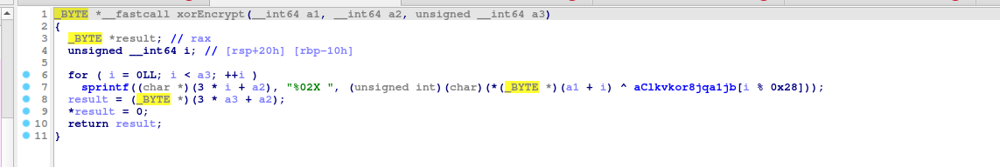
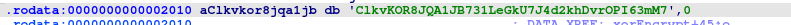

# Rev / Snail Farmer John 
Author : Marvin 

## Challenge Description 
Farmer John has moved on from cows to snails.

Please ignore any potential integer overflow (i.e. pretend that the program can handle arbitrarily large numbers).

**Challenge Files**   
[input.txt]('../assets/rev/input.txt') and [slow.cpp](../assets/rev/slow.cpp)  

```C++
#include <cstdint>
#include <fstream>
#include <iostream>
#include <vector>
using namespace std;

vector<int> comb(vector<int> in) {
    vector<int> out;
    vector<uint64_t> prefix ; 
    for(int i = 0 ; i < in.size(); i++){
    	
    }
    for (int i = 0; i < in.size(); i++) {
        for (int j = i + 1; j < in.size(); j++) {
            out.push_back(in[i] * in[j]);
        }
        out.push_back((in[i] * (in[i] - 1) / 2));
    }
    return out;
}
int main() {
    ifstream fin("input.txt");
    ofstream fout("slow.out");
    int n, k;
    fin >> n >> k;
    vector<int> score;
    for (int i = 0; i < k; i++) {
        int temp;
        fin >> temp;
        score.push_back(temp);
    }
    for (int i = k; i < n; i++) {
        score.push_back(1);
    }
    uint64_t output = 0;
    for (int j = n; j >= k; j -= 3) {
        vector<int> part = vector<int>(score.begin(), score.begin() + j);
        vector<int> res = comb(comb(part));
        for (int i = 0; i < res.size(); i++) {
            output += res[i];
        }
    }
    fout << "bcactf{" << output << "}" << endl;
}
``` 
The above script does some calculations to print out a number and our goal was to speed up the above script to find the flag 

## Solution 

In [input.txt](../assets/rev//input.txt) we are given two numbers `n` and `h` whose values are `500000` and `200000` respectively, and an array of length `200000`.    

The first step was to figure out the working of `comb` function, if you look carefully the script is actually adding the `sum` of return value of `comb(comb(part))` to the actual output. 
```python
output += sum(comb(comb(part)))
```

Let and array be $\{a_1, a_2, a_3\}$, so 
$$
comb(\{a_1, a_2, a_3\}) = [a_1(a_2+a_3), a_2a_3, \frac{a_1(a_1-1)}{2}, \frac{a_3(a_3-1)}{2}, \frac{a_3(a_3-1)}{2}]
$$

$$
sum(comb(\{a_1, a_2, a_3\})) = (a_1 * (a_2 + a_3) + a_2 * a_1 + a_1) + \frac{a_1(a_1-1)}{2} + \frac{a_2(a_2-1)}{2} + \frac{a_3(a_3-1)}{2}
$$

$$
sum(comb(\{a_1, a_2, a_3\})) = \frac{2a_1a_2 + 2a_2a_3 + 2a_1a_3 + {a_1}^2 + {a_2}^2 + {a_3}^2 - (a_1 + a_2 + a_3)}{2}
$$

$$

sum(comb(\{a_1, a_2, a_3\})) = \frac{(a_1 + a_2 + a_3)^2 - (a_1 + a_2 + a_3)}{2}  

$$

In general:
$$
sum(comb(\{a_1, a_2, a_3, ...a_n\})) = \frac{\sum{a_i}* (\sum{a_i}-1)}{2} 
$$   

or, 

$$
sum(comb(comb(\{a_1, a_2, a_3, ...a_n\}))) = \frac{\sum{a_i} * (\sum{a_i}-1) * (\sum{a_i}-2) * (\sum{a_i}+1)}{8}
$$     

Thus we have reduced the operation to a single linear time function of `sum`. The program is looping from the end of final array (appended with 1's) to start of initial array, thus we can pre-calculate the sum of array and then we'll have to add to number of 1's which will be the sum of each part. 

So the final script can be reduced to : 
```python
def optimised_comb(S):
    return (S*(S-1)*(S-2)*(S+1))//8

vals, data = open("input.txt").read().split("\n")
n, k = list(map(int, vals.split(" ")))
array = list(map(int, data.split(" ")))
final_array = array + [1] * (n-k) 

output = 0 
arr_sum = sum(final_array)
for j in range(n, k-1, -3):
    part_sum = arr_sum + (j-k) #Adding number of ones to total sum 
    output += optimised_comb(part_sum)
print("bcactf{" + str(output) + "}") 
```  

#### Flag 
`bcactf{1256717047406103274281000233490626854133493566253}`

# Rev/XOR
## Challenge Description
The executable below outputs an encrypted flag using the XOR operator. Can you decompile and reveal the flag?

## Hint
What is symmetric encryption?

## Resources
[xor](../assets/scripts/xor/xor)

## Solution
On checking the binary, we see a `XOR function`.



and the string `aClkvkor8jqa1jb` is `ClkvKOR8JQA1JB731LeGkU7J4d2khDvrOPI63mM7`.



``` console
nc challs.bcactf.com 32411
Encrypted flag: 21 0F 0A 15 3F 29 29 6B 13 1C 2C 74 7D 30 5E 50 6E 29 2B 24 19 0C 67 7D 05 54 7C 34 5C 13 32 42 29 62 7B 0F 4E 
```

So we `XOR` the `encrypted flag by key` to get back the `flag`.

``` python
encrypted = "21 0F 0A 15 3F 29 29 6B 13 1C 2C 74 7D 30 5E 50 6E 29 2B 24 19 0C 67 7D 05 54 7C 34 5C 13 32 42 29 62 7B 0F 4E"
key = "ClkvKOR8JQA1JB731LeGkU7J4d2khDvrOPI63mM7"

encrypted_bytes = bytes.fromhex(encrypted.replace(" ", ""))

decrypted_bytes = bytes(encrypted_byte ^ key_byte for encrypted_byte, key_byte in zip(encrypted_bytes, key.encode()))

print(decrypted_bytes)
```
## Flag
`bcactf{SYMmE7ric_eNcrYP710N_4WD0f229}`