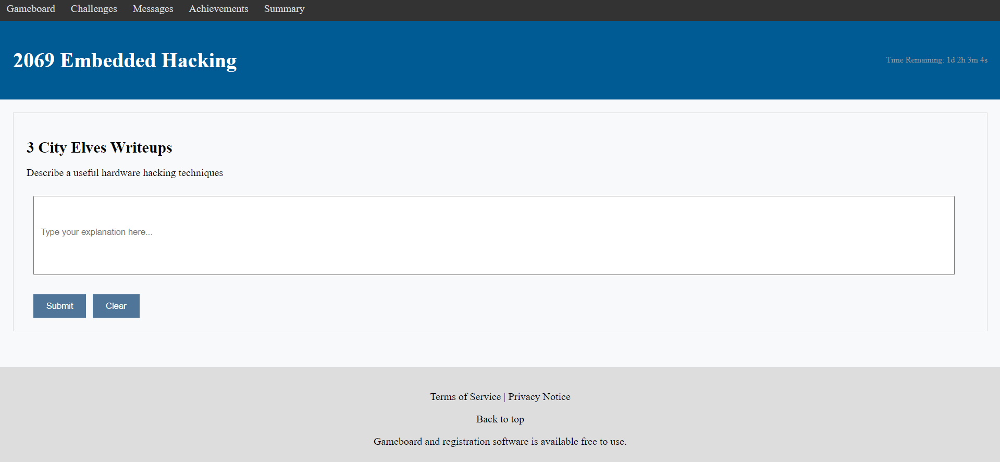
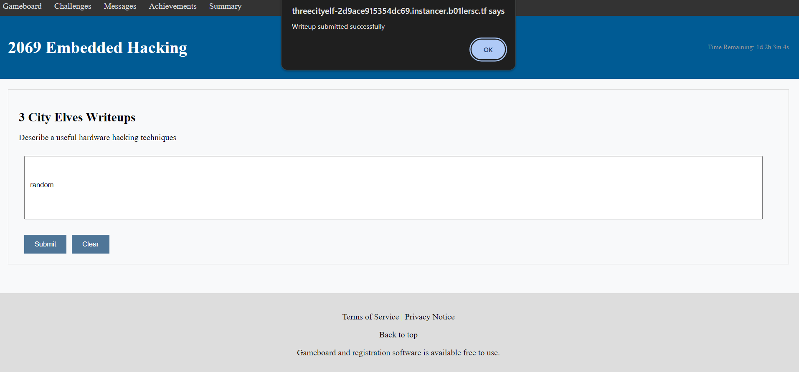
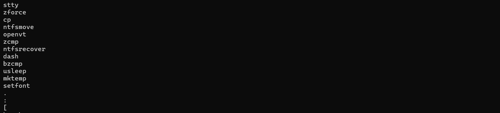
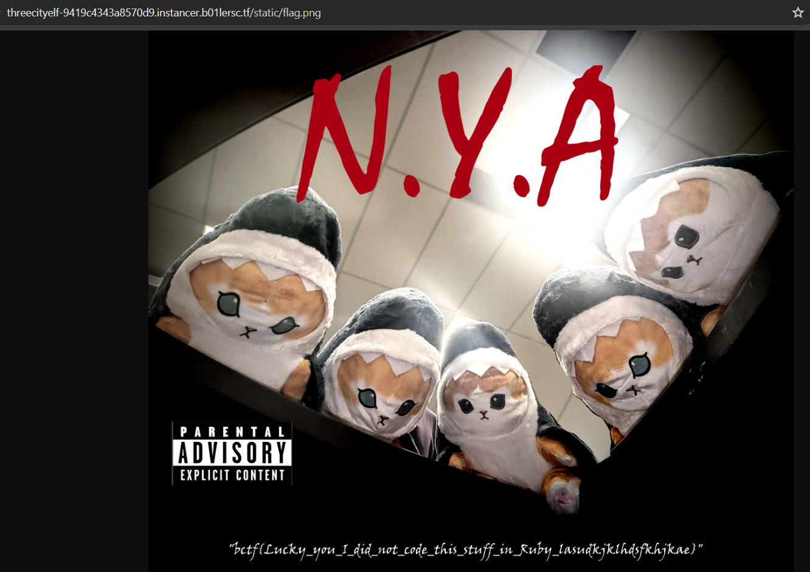

# web/3-city-elves-writeups

## Challenge Description

I'm competing in a CTF so I don't have time to make my 3-city-elves challenge. How about you guys help me with the CTF I'm in by submitting some writeups? I would really appreciate it! I only need some kind of medical hardware hacking, like insulin pump hacking. Supply chain is also acceptable. Don't try to do anything silly, the writeup submission comes with a next-gen WAF. We need your help to beat Contraband Manchester United and Sigma Pony!

https://instancer.b01lersc.tf/challenge/threecityelf

### Files

[3-city-elves-writeups.zip](./assets/3-city-elves-writeups.zip)

## Challenge Overview

First let's try and visit the site and see what it has.



We are given a page with an input box. We can enter some text in there and then it gives an alert saying writeup submitted successfully.



Now let's see the source code. We are given different files along with a `flag.png` which contains the flag most probably on the server. So our job is to somehow see this file.

Analyzing the `app.py`, what it does is:

* Extracts the `content` that we submit
* Passes the `content` through a `sus()` function which is imported from `waf.py`
    * If `sus()` returns true, the program simply returns an alert saying `The requested URL was rejected`
    * If it returns false, the program continues
* Makes a random `filename`
* Writes the `content` to this `filename` using the `os.system` command

    ```py
    os.system(f"bash -c \'echo \"{content}\" > {filename}\'")
    ```
    * This is where we can potentially inject some command to exploit it
* Then it simply deletes the file it writes to

Analyzing the `waf.py`:

* Implements the `sus()` function which simply checks whether the `content` passed to it contains any word from the `taboo` list.
    * `taboo` is a list of some linux commands and also other symbols like `/`, `x`, etc.

## Exploit

So the first thing I did was to try and find what are the commands that are available to me that I can use. So I created a simple script to see which commands are not inside `taboo`.

[check.py](./assets/check.py)

I got the wordlist from this github page - [linux commands](https://github.com/yzf750/custom-fuzzing/blob/master/linux-commands-merged.txt)



And after just fuzzing a little with the content, I found that `"` and also `;` are allowed.

Running it, we can see that we have the `cp` command available to us. So we could craft an exploit that copies the `flag.png` into the `assets` directory and then we can access it by going to `static/flag.png`.

So this exploit given below should do the work.
```
"; cp ../flag.png assets; "
```

But when I tried sending this, I get the same alert back saying `The requested URL was rejected`. So the `sus()` function must be blocking some other things. So I ran the challenge locally and added some code that would print which word in `taboo` was found in content so I could see why the command didn't work.

So, I found that it was blocking the `/` in the content. So I had to find a bypass to it. This can be easily done by extracting that character from the `$HOME` environment variable. So our new exploit is this.
```
"; cp ..${HOME:0:1}flag.png assets; "
```

 But we again get the same response back because `ss` is also not allowed. I used `*` in order to bypass this and finally the exploit we get is this.
```
"; cp ..${HOME:0:1}flag.png as*sets; "
```

And now we get `Writeup submitted succesffuly` and we can see the flag by going to `static/flag.png`


