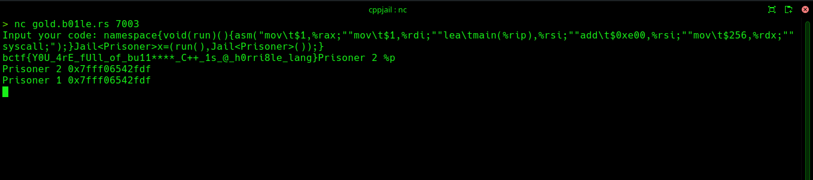

In this challenge, we're given three files: cppjail.cpp, flag.h, and compile.py. Starting with compile.py, let's examine the source code of each of these three files.

The Python program expects C++ code as user input. After filtering certain words and characters, it writes the resulting code to jail.cpp, compiles, and runs it.
```py
banned_words = [
    "#", "define", "include",
    "//",
    "ifndef", "ifdef",
    "Lock", "Key",
    "class", "struct",
    "*", "int", "char", "short", "long",    
    " "
]
```

Here's cppjail.cpp
```cpp
#include <type_traits>
#include "flag.h"
#include <cassert>
constexpr char flag[] = FLAG;

template<class b> struct Key {
    short i;
};

template<> struct Key<std::
bool_constant<false>>{
    char i;
};
template<> struct Key<std::
bool_constant<true>> {
    int i;
};
template<char c, int i> struct Lock {
    Key<std::bool_constant<flag[i] == c>>k;
};

template<class, class = void> struct Jail: :: std :: false_type {
    template<char c, int i> using lock=Lock<c, i>;
};
template<class T> class Jail<T, ::std::void_t<decltype(&std::declval<T>())>>: :: std ::true_type{};

class Prisoner {};

#undef FLAG
#define flag

/* you are here */

#include <stdio.h>

int main(void) {
    ::Prisoner prisoner1;
    ::Prisoner prisoner2;
    
    assert((&prisoner1) != (&prisoner2));
    ::printf("Prisoner 2 %p\n", &prisoner1);
    ::printf("Prisoner 1 %p\n", &prisoner1);
}
```
The Python program replaces the string `/* you are here */` with the input supplied by the user. Our goal is to read the flag. However, we're not allowed to use `#`, `#define`, or `#include`, so we can't use standard C/C++ library functions for reading the flag. Therefore, we'll utilize inline assembly to execute the write system call and leak the data.

However, there's a catch that using space characters are not allowed and our assembly code is likely to contain space characters. There's a bypass for it: using `\t`. We can leak data by executing the write system call. For that, let's compile `jail.cpp` locally, and use pwndbg for getting a rough idea about the distance of `flag` from `main`,
.
```sh
pwndbg> p/x &flag
$1 = 0x2020
pwndbg> p/x &main
$2 = 0x1169
pwndbg> p/x 0x2020-0x1169
$3 = 0xeb7
```

In this case, flag is 0xeb7 bytes away from main. Let's dump some bytes, and let's assume that `addr` is the memory address which is 0xe00 bytes away from `main`. Then, it's very likely that the flag will be present somewhere between `addr` and `addr + 0x100`. Let's write the assembly code for dumping 0x100 bytes, starting from addr, to stdout.
```s
asm("mov\t$1,%rax;""mov\t$1,%rdi;""lea\tmain(%rip),%rsi;""add\t$0xe00,%rsi;""mov\t$256,%rdx;""syscall;");
```

Having completed the assembly code, the main task is to execute it. We can't directly execute functions at global scope though. However, this can be done by using namespaces and the comma operator. The comma operator (,) evaluates expressions from left to right and returns the result of the rightmost expression.

In the following code, we've stored the inline assembly within the `run` function. Because of the behaviour of the comma operator, the `run` function is called and the inline assembly code within it dumps the flag for us.
```cpp
namespace{void(run)(){asm("mov\t$1,%rax;""mov\t$1,%rdi;""lea\tmain(%rip),%rsi;""add\t$0xe00,%rsi;""mov\t$256,%rdx;""syscall;");}Jail<Prisoner>x=(run(),Jail<Prisoner>());}
```

