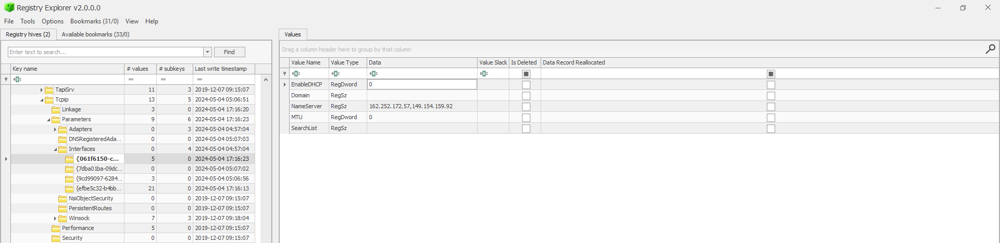

# Forensics/Did Nobody See? Writeup -->

## Challenge Description 
>We recently obtained a triage image from a Windows laptop belonging to a suspected ransomware operator. The suspect used several anti-forensic techniques and managed to erase any form of web history. We suspect that we may be able to use data from DNS servers as evidence to tie the suspect to the operation. Unfortunately, the suspect was using a VPN. Can you find any DNS servers used during the VPN connection?

## Solution 
Here we need to find the ip address used to make connection with Windows laptop and as we are given the triage image we have the access to all the registry hives stored under 

`did-nobody-see\Windows\System32\config` and the fact we would use is that all the IP addresses of the various network interfaces are stored under:

`HKEY_LOCAL_MACHINE\SYSTEM\CurrentControlSet\Services\Tcpip\Parameters\Interfaces`

so we extract the Sytem regitsry from the folder and use a famous tool known as `Registry Explorer` [tool](https://ericzimmerman.github.io/#!index.md) by Eric Zimmerman  to parse the registry and go to the desired location and we find 

We can find 2 ip associated with the connected name server and anyone of them is the correct flag so the flag for the challenge was

`byuctf{162.252.172.57}` or `byuctf{149.154.159.92}`