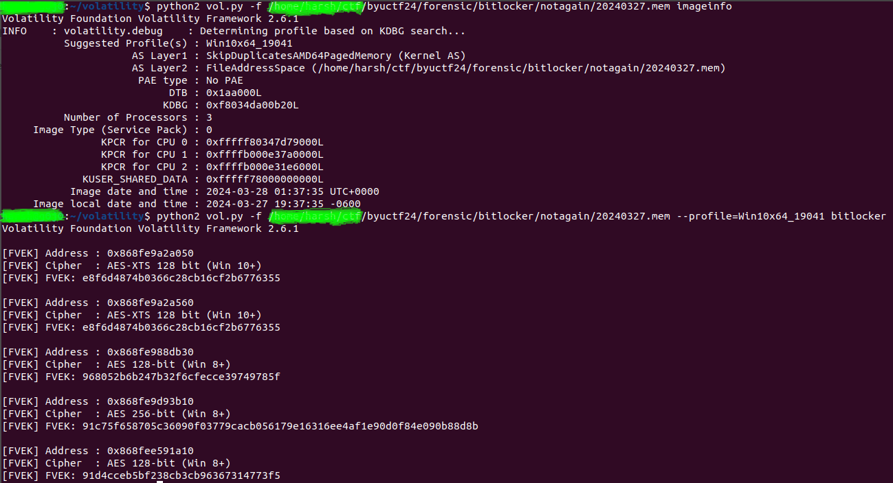

# Forensic/Not again! I've been BitLockered out of my own computer!

## Challenge Description:-

Install Bitlocker they said... it will protect your data they said... Well, now I don't have access to any of my data because I forgot my password... again! Can you find my FVEK keys? I managed to capture my RAM so they should be in there

Flag format - `byuctf{key1_key2_key3}` (order not significant)

* Mirror 1 - https://byu.box.com/s/paexcd1t1er8bj435gg88i52q9ho8ftf
* Mirror 2 - https://drive.google.com/file/d/1EAYpFu0ULc4fGt2qNoJTaNvG4F9A8Vw7/view?usp=sharing

## Solution:- 

As the user has captured the RAM, provided to us as the 20240327.mem file, I started searching for BitLocker. We found a plugin for the [Volatility2](https://github.com/volatilityfoundation/volatility) tool at [plugin](https://github.com/breppo/Volatility-BitLocker). Since the file is also a memory file, it was straightforward to use the plugin.

First, we needed the profile, so I used the following command in my terminal(using `Volatility2`):

```$ python2 vol.py -f 20240327.mem imageinfo```

It took a lot of time about 7-8 minutes—but eventually, it provided the profile Win10x64_19041. After that, I used the BitLocker plugin:

```$ python2 vol.py -f 20240327.mem --profile=Win10x64_19041 bitlocker```

We got 5 FVEK keys, but after trying some possible combinations, I realized only Win8+ was accepted.

I've provided the ss of my solution.


## Flags:-
```
byuctf{968052b6b247b32f6cfecce39749785f_91c75f658705c36090f03779cacb056179e16316ee4af1e90d0f84e090b88d8b_91d4cceb5bf238cb3cb96367314773f5}

byuctf{968052b6b247b32f6cfecce39749785f_91d4cceb5bf238cb3cb96367314773f5_91c75f658705c36090f03779cacb056179e16316ee4af1e90d0f84e090b88d8b}

byuctf{91d4cceb5bf238cb3cb96367314773f5_968052b6b247b32f6cfecce39749785f_91c75f658705c36090f03779cacb056179e16316ee4af1e90d0f84e090b88d8b}

byuctf{91d4cceb5bf238cb3cb96367314773f5_91c75f658705c36090f03779cacb056179e16316ee4af1e90d0f84e090b88d8b_968052b6b247b32f6cfecce39749785f}

byuctf{91c75f658705c36090f03779cacb056179e16316ee4af1e90d0f84e090b88d8b_91d4cceb5bf238cb3cb96367314773f5_968052b6b247b32f6cfecce39749785f}

byuctf{91c75f658705c36090f03779cacb056179e16316ee4af1e90d0f84e090b88d8b_968052b6b247b32f6cfecce39749785f_91d4cceb5bf238cb3cb96367314773f5}
```
