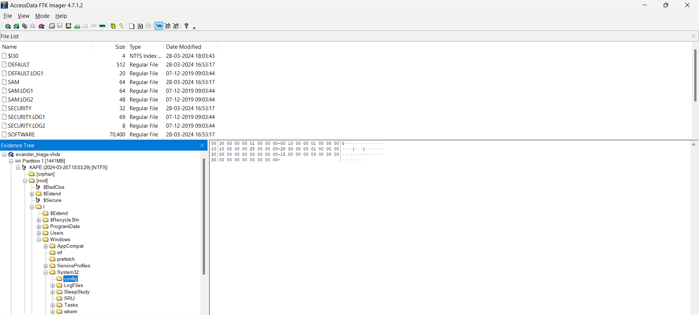
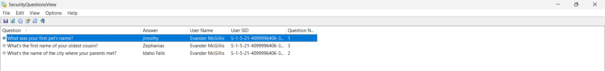

# Forensics/Not Sure I'll Recover From This Writeup

## Challenge Description 

> You know, passwords arent easy for person of my age, it's pretty hard to remember my password, let alone my security questions! I can't login now, can you help a friend out and recover my security questions so I can login?

```
Q1: What was your first pet's name?
Q2: Where did your parents meet?
Q3: What's the first name of your oldest cousin?
```

## Solution
So here we need to find about the security questions associated with a Windows laptop and we are given its hard disk image file `evander_triage.vhdx` so on a quick opening of this in `FTK Imager` shows results as 



Again the fact that we gonna use is that Windows stores its security question in SAM (Security Account Manager) registry of the system which can be found at 
`Windows\System32\Config\SAM`

Now we use a Security Questions Parsing tool known as `securityquestionsview` (https://www.nirsoft.net/utils/security_questions_view.html) to parse the SAM registry of the given triage file and voila we find our security questions and their answers. 



And finally our flag becomes `byuctf{jimothy_Idaho_Falls_Zephanias}`.