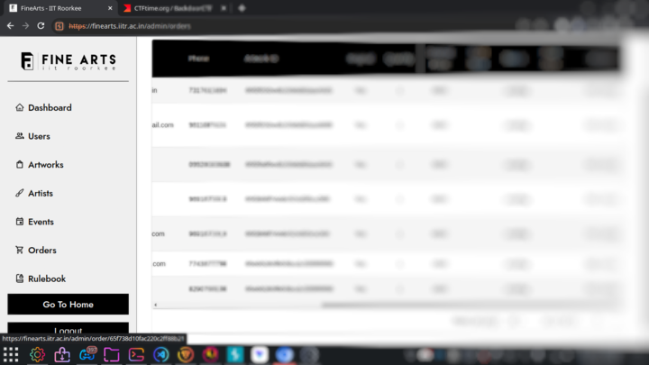

# Pentesting Finearts Website

# Introduction
The FineArts Club, IIT Roorkee is a group of talented artists who organise various workshops throughout the year. These workshops are open to everyone on the campus and aim to teach various forms of art ranging from Origami to Pencil Sketching. Being InfoSec enthusiasts, we always ensure that the resources of our fellow campus groups stay secure. Therefore, we tried to scan for any form of vulnerabilities lying on the website waiting to be exploited. We found several vulnerabilities and were able to successfully exploit them too. After doing a responsible disclosure of the bugs to the maintainers of the website, we have prepared this writeup which basically demonstrates the whole scenario from bug finding straight to its exploitation.

##

Roaming around the website we found a route `/admin` which surprisingly had a registration page where any arbitrary user could create a new account. So after creating a new account we got access to all the functionalities available on the page. However, a user created in this way is assigned the role `user` by default which doesn't have enough privileges to do anything intriguing.

It is clearly visible that we have different features such as creating and viewing new artworks, artists, viewing information about orders,etc.

Creating a new artist or an artwork via the admin panel gave us a `401 unauthorized error`. Therefore, we decided to use BurpSuite to capture the request. Using Burp Suite, we captured the request and quickly found a JSON Web Token (JWT) in the request headers. Using [jwt.io](https://jwt.io/), we decoded the Json Web Token and got the following payload.

It’s clearly visible that the JWT payload has a special value `UserRole` which was set to `user` by default. This means that any new user created via the admin panel would be assigned the role `user` which doesn’t have enough privileges to create new artists and artworks. Therefore, we decided to perform privilege escalation in order to gain elevated privileges (for example, admin).

We tried common exploits of JWT such as `Weak Key Attack` and it worked. We used jwt_tool to crack the JWT and the signature key we found was surprisingly empty which is a bad practice in terms of web security.

Hence we modified the token using [jwt.io](https://jwt.io/) and changed the `UserRole` to admin and forged the token as given below.

We sent the same request again with the forged token. And yesss we added the artwork successfully.

 Similarly, we were able to control other features such as creating new artists, editing and deleting orders, updating price of artworks, creating new events, etc.

The following changes were reflected on the original website:

All hail **InfoSecIITR**!!
