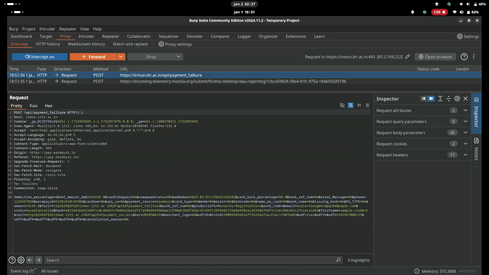

# Hacking IRMUN website

Hi everyone! I’m Kapil Sareen, *aka **v1p3r***, a wannabe hacker and a member of **@InfoSecIITR**. Today I’m excited to share what I **HACKED**!

I’ll walk you through the process of discovering the vulnerability and demonstrate how small mistakes during development can lead to significant consequences.

First, let’s give a shoutout to our sweet little vulnerable target — `IRMUN`. The bug was actually in their payment gateway integration, which allowed us to bypass payments entirely and enjoy free accommodations and food, all courtesy of our generous host, `IRMUN`.

Alright, let’s dive into the real action!
We’ll start by making a sample registration to see how we can avail the free goodies. But before proceeding, let’s check the payment status:

As we can see, our **payment status** shows as **incomplete**.  

Let’s attempt to **make a payment** while intercepting the requests using **Burp Suite** to monitor the traffic in real-time. We get redirected to the **payment page**, but… wait! We’re broke. So, let’s **cancel the payment** and return to inspect the backend requests captured by **Burp Suite**.  

One request immediately stands out — it’s directed to the endpoint:  
**`/api/payment_failure`**.  

    
    
    

Let’s send this request to **Repeater** and see what it’s up to. Hmm… something feels off. The request body contains some peculiar URLs:  

- **`surl=http://irmun.iitr.ac.in/api/payment_failure`**  
- **`furl=http://irmun.iitr.ac.in/api/payment_failure`**  

Could these represent **success URL** and **failure URL**? And why is the request being sent to `/api/payment_failure`?  

Let’s experiment by changing the endpoint to:  
**`/api/payment_success`**  

  

Interesting… we get a **302 redirect** to `/successful`. Looks like we’ve stumbled upon something promising.  

Now, let’s **drop all pending requests**, refresh the page, and **recheck our payment status**.  

  

#### 🎯 **Voila! The payment is marked as complete.**  

Now we can enjoy all the **free goodies** without spending a dime!  

---

**📝 PS:** This vulnerability has been **responsibly reported** to and **patched by IRMUN**, so don’t worry — this is all **legal stuff**. 😉  